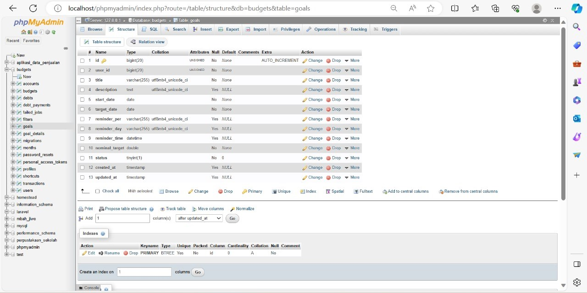
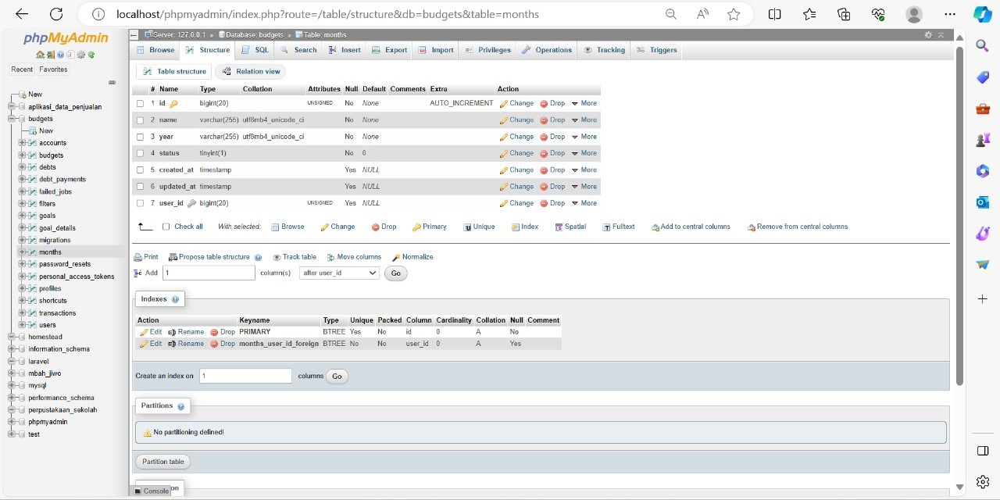
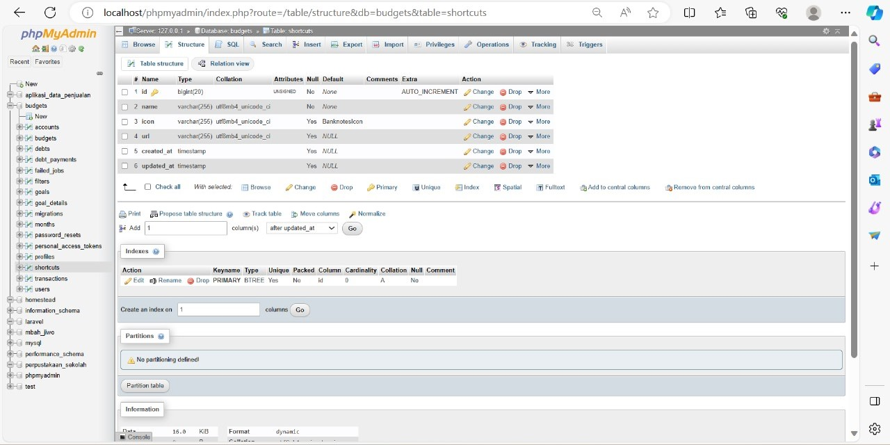
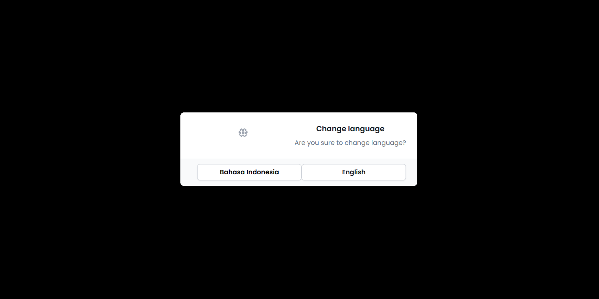

<!DOCTYPE html>
<html>
<head>
  <h1 align="center">Simple Budgets</h1>
</head>
<body>

<table>
  <tr><td>Nama</td><td>Fiona Orinda Sugionoto</td></tr>
  <tr><td>NIM</td><td>12030122120009</td></tr>
  <tr><td>Mata Kuliah</td><td>Sistem Informasi Akuntansi</td></tr>
  <tr><td>Dosen</td><td>Dr. Totok Dewayanto, SE., M.Si, Ak, CA</td></tr>
</table>

 

<h2>Keterangan</h2>

Simpel Budget adalah aplikasi web yang dirancang untuk membantu Anda mengelola anggaran bulanan dengan mudah dan tanpa perlu banyak tutorial atau proses yang rumit. Aplikasi ini menyediakan antarmuka yang sederhana dan intuitif, sehingga memudahkan Anda untuk melacak pemasukan, pengeluaran, dan transfer uang Anda.

 

<h2>phpMyAdmin</h2>

<h4 align="center">Structure</h4>

<h4 align="center">Designer</h4>

<h4 align="center">Structure "Accounts"</h4>

<h4 align="center">Structure "Budgets"</h4>

<h4 align="center">Structure "Debts"</h4>

<h4 align="center">Structure "Debt Payments"</h4>

<h4 align="center">Structure "Failed Jobs"</h4>

<h4 align="center">Structure "Filters"</h4>

<h4 align="center">Structure "Goals"</h4>

<h4 align="center">Structure "Goal details"</h4>

<h4 align="center">Structure "Migations"</h4>

<h4 align="center">Structure "Months"</h4>

<h4 align="center">Structure "Password Resets"</h4>

<h4 align="center">Structure "Personal Access Tokens"</h4>

<h4 align="center">Structure "Profiles"</h4>

<h4 align="center">Structure "Shortcuts"</h4>

<h4 align="center">Structure "Transactions"</h4>

<h4 align="center">Structure "Users"</h4>

 

<h2>Website</h2>

<h4 align="center">Tampilan Awal</h4>

<h4 align="center">Fitur</h4>

<h4 align="center">Sign Up</h4>

<h4 align="center">Sign In</h4>

<h4 align="center">Masukan Username dan Password</h4>

<h4 align="center">Home</h4>

<h4 align="center">Expense, Income, dan Transfer </h4>

<h4 align="center">Anggaran</h4>

<h4 align="center">Profil</h4>

<h4 align="center">Akun</h4>

<h4 align="center">Merubah Bahasa</h4>

<h4 align="center">Tujuan</h4>

<h4 align="center">Utang</h4>

<h4 align="center">Setting User</h4>

</body>
</html>
